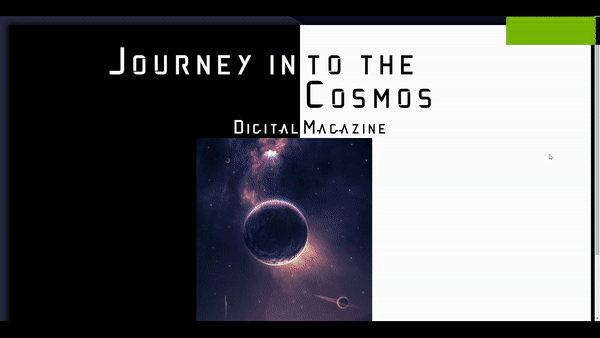

# Journey into the Universe

### Stack/Technologies used:-

**HTML**

**JavaScript**

**CSS**

  

"Journey into the Universe" is my final project submission for my Web Development module, as part of my BSc Computer Science degree.

There was an immense amount of thought and research that went into the pre planning, brainstorming and initilisation stages. Along the way, upon each iteration, as more of my initial plan came about, the urge to add more and more along the lines of the dreaded "feature creep" occured, which led to me abstracting until I was happy with a more _minimalistic_ take - the core theme in terms of color and layout came from entropys perpetual grip, causing disorder in the Universe. 

Thank you for visiting!
 

## Getting Started

These instructions will get you a copy of the project up and running on your local machine for development and testing purposes. See deployment for notes on how to deploy the project on a live system.

### Installing

A step by step series of examples that tell you how to get a development env running
 
 
**1 - Under the repository name, right-hand side, click the 'Code' button.**
 
**2 - In the following pop-up box, depending on personal prefrences, there are a number of methods for you to get up and running - whether that be from downloading the zip itself, or using https / github CLI.**
 

#### Demo

